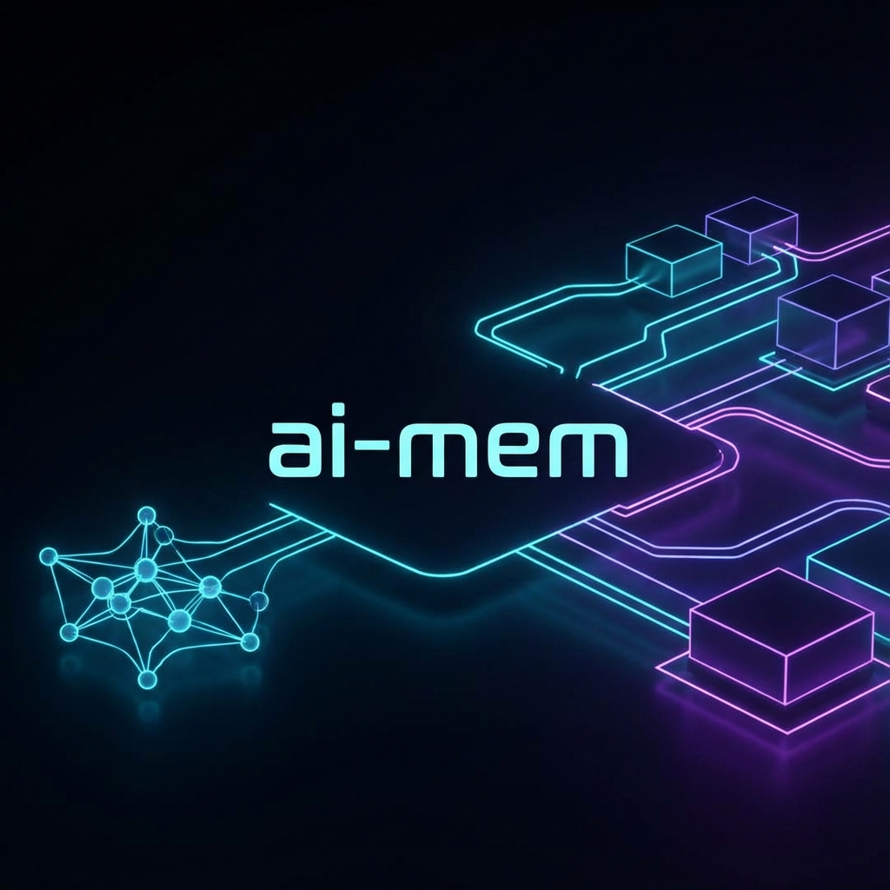
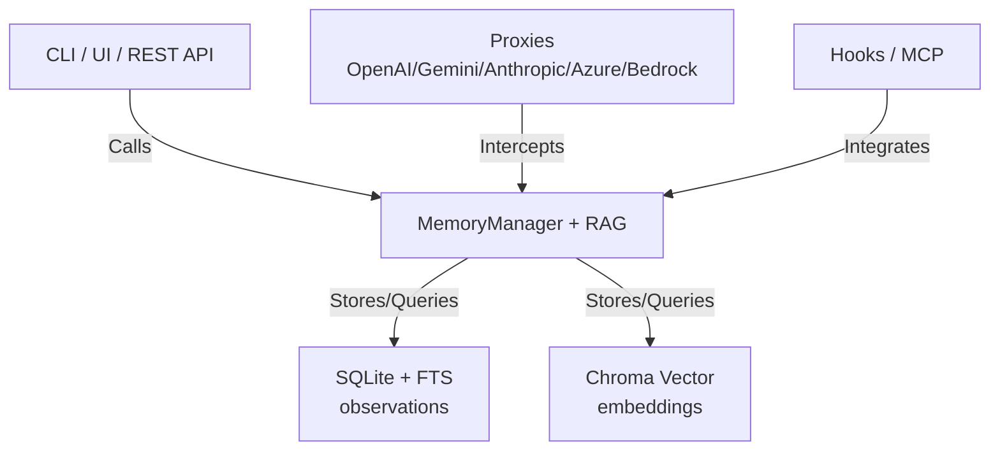

# ai-mem: Universal Long-Term Memory for LLMs




ai-mem is a local-first memory layer for **any LLM**. It stores observations in a SQLite + FTS5 database, adds semantic search via a local vector store, and injects the right context when you start a new task.

Works with **Gemini**, **Anthropic**, **OpenAI-compatible APIs**, and **MCO tools**.

## Key Features

- 🧠 **Model Agnostic** - Gemini native + OpenAI-compatible + Azure OpenAI + AWS Bedrock.
- 🔒 **Local & Private** - SQLite + FTS5 + ChromaDB stored on disk.
- 🔍 **Hybrid Search** - Semantic + keyword retrieval for relevance.
- 📊 **Progressive Disclosure** - Search → Timeline → Full detail.
- 🖥️ **Web Viewer UI** - Browse, search, and manage memory visuals.
- 🔄 **Live Stream & Auto-refresh** - Real-time stream with auto-refresh countdown + cache health indicator tied to hybrid scores.
- 🤖 **Context Injection** - Generate context blocks for any model.
- 🔌 **MCP Tools** - Ready for Claude Desktop and other MCP clients.
- 🖇️ **Hooks & Proxies** - Automatic storage and injection.

## 🚀 Quick Start

```bash
# 1. Install
pip install -e .

# 2. Add memories
ai-mem add "We use Python 3.11 and pandas 2.0"

# 3. Search
ai-mem search "Python dependencies"

# 4. Start the UI (http://localhost:8000)
./scripts/run.sh
```

## 🏗️ Architecture



## 📚 Documentation

Detailed documentation is available in the `docs/` directory:

- [🚀 Getting Started](docs/getting-started.md) - Installation, Quick Start details.
- [⚙️ Configuration](docs/configuration.md) - Config, Vector Store, Caching.
- [🔌 Proxies](docs/proxies.md) - OpenAI, Gemini, Anthropic, Azure, Bedrock proxies.
- [🛠️ MCP Tools & Integrations](docs/mcp-tools.md) - MCP Server, Claude Plugin, IDE setups. The doc now explains how `mem-search`/`timeline` return scoreboard/cache metadata and how to request JSON context outputs for MCP clients.
- [🎣 Hooks](docs/hooks.md) - Lifecycle hooks for shell and IDEs.
- [🧩 Presets](docs/presets.md) - Installer scripts for hooks, IDE tasks, Claude mem-search skill, and MCP clients like Antigravity.
- [📖 API Reference](docs/api-reference.md) - REST API endpoints and storage layout.
- [🏛️ Architecture](docs/architecture.md) - Core concepts and design.
- [💻 Development](docs/development.md) - Testing, Roadmap, Credits.

## Credits

Inspired by [claude-mem](https://github.com/thedotmack/claude-mem).
