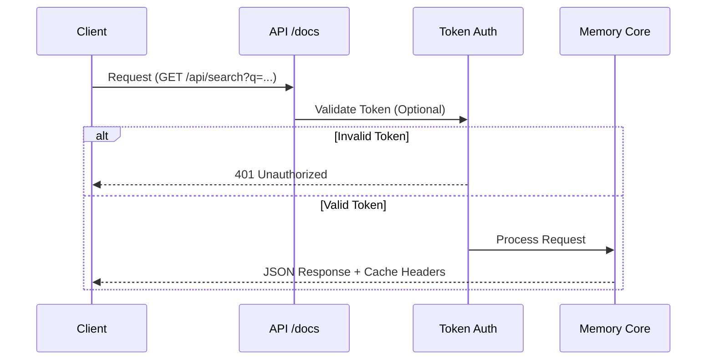

# API Reference

## REST API Content Flow



## Endpoints

When you run `ai-mem server`, interactive documentation is available at [http://localhost:8000/docs](http://localhost:8000/docs).

### Core Operations

| Method | Endpoint | Description | Key Parameters |
| :--- | :--- | :--- | :--- |
| `POST` | `/api/memories` | **Add Memory** | `content`, `project`, `session_id`, `tags` |
| `POST` | `/api/events` | **Ingest Event** | `host`, `payload`, `session_id`, `tags` |
| `GET` | `/api/search` | **Search** | `q`, `start_date`, `end_date`, `limit` |
| `GET` | `/api/timeline` | **Timeline** | `session_id`, `depth_before`, `depth_after` |
| `GET` | `/api/observations` | **List All** | `limit`, `since`, `project` |
| `GET` | `/api/observations/{id}` | **Get One** | `id` |

### Event Ingestion

The `/api/events` endpoint accepts raw events from any LLM host and converts them to observations using host-specific adapters.

**Request Format:**

```json
{
  "host": "gemini",
  "payload": {
    "tool_name": "Read",
    "tool_input": {"path": "/src/main.py"},
    "tool_response": "file contents..."
  },
  "session_id": "optional-session-id",
  "project": "/optional/project/path",
  "tags": ["optional", "extra-tags"],
  "summarize": true
}
```

**Supported Hosts:**

| Host Value | Adapter | Payload Format |
| :--- | :--- | :--- |
| `claude-code`, `claude-desktop` | ClaudeAdapter | `tool_name`, `tool_input`, `tool_response` |
| `gemini`, `gemini-cli` | GeminiAdapter | `function_call.name`, `function_call.args`, `function_response.response` |
| Any other | GenericAdapter | Auto-detects from common field names |

**Response Format:**

```json
{
  "status": "ok",
  "observation": {
    "id": "obs_abc123",
    "content": "Tool: Read\nInput: {...}\nOutput: ...",
    "type": "tool_output",
    "tags": ["gemini", "tool", "auto-ingested"],
    "created_at": 1704672000.0
  },
  "event_type": "tool_use",
  "event_id": "uuid-for-idempotency"
}
```

**Idempotency:**

Each event is assigned an `event_id` for deduplication. If the same `event_id` is sent twice, the existing observation is returned without creating a duplicate.

**Example with curl:**

```bash
curl -X POST http://localhost:37777/api/events \
  -H "Content-Type: application/json" \
  -H "Authorization: Bearer $AI_MEM_API_TOKEN" \
  -d '{
    "host": "cursor",
    "payload": {
      "tool_name": "Bash",
      "tool_input": {"command": "npm test"},
      "tool_response": "All tests passed"
    }
  }'
```

### Session Management

| Method | Endpoint | Description | Key Parameters |
| :--- | :--- | :--- | :--- |
| `GET` | `/api/sessions` | **List Sessions** | `active_only`, `project` |
| `POST` | `/api/sessions/start` | **Start Session** | `goal`, `project` |
| `POST` | `/api/sessions/end` | **End Session** | `session_id` |

### Context Injection (RAG)

| Method | Endpoint | Description | Key Parameters |
| :--- | :--- | :--- | :--- |
| `GET` | `/api/context` | **Get Context Block** | `query`, `total`, `full` |
| `GET` | `/api/context/preview` | **Preview Context** | Same as above (alias) |

### Scoreboard & cache telemetry

The JSON payloads for `/api/search`, `/api/timeline`, and `/api/context` include a `scoreboard` map (FTS, vector, recency) plus the `cache` counters. This mirrors the scoreboard the CLI prints during `ai-mem endless` and what the web UI displays at `http://localhost:37777`.

```json
{
  "scoreboard": {
    "obs_abc": {
      "fts_score": 0.92,
      "vector_score": 0.81,
      "recency_factor": 0.56
    }
  },
  "cache": {
    "hits": 14,
    "misses": 2
  }
}
```

Query responses also include `tokens` totals (`index`, `full`, `total`) and `economics` data so you can estimate the formatted context before injecting it into any assistant.

### Metadata & Maintenance

| Method | Endpoint | Description | Key Parameters |
| :--- | :--- | :--- | :--- |
| `GET` | `/api/tags` | **List Tags** | `project` |
| `POST` | `/api/tags/add` | **Add Tag** | `tag`, `filters...` |
| `GET` | `/api/stats` | **Global Stats** | `project` |
| `GET` | `/api/health` | **Health Check** | - |

> [!NOTE]
> **Search Cache Header**: `/api/search` responses include `X-AI-MEM-Search-Cache` with values `hit` or `miss`.

## Storage Layout

Default data directory: `~/.ai-mem`

- **SQLite**: `~/.ai-mem/ai-mem.sqlite`
- **Vector DB**: `~/.ai-mem/vector-db`

### Customizing Paths

You can override storage locations via CLI config:

```bash
ai-mem config --data-dir /path/to/data
ai-mem config --sqlite-path /path/to/ai-mem.sqlite
ai-mem config --vector-dir /path/to/vector-db
```

## Privacy and Redaction

> [!IMPORTANT]
> Use `<private>...</private>` tags in any memory content to prevent that specific segment from being stored.

- Private segments are stripped **before** hashing, indexing, and storage.
- The `<ai-mem-context>` tag is reserved and automatically stripped to prevent recursive ingestion loops.
