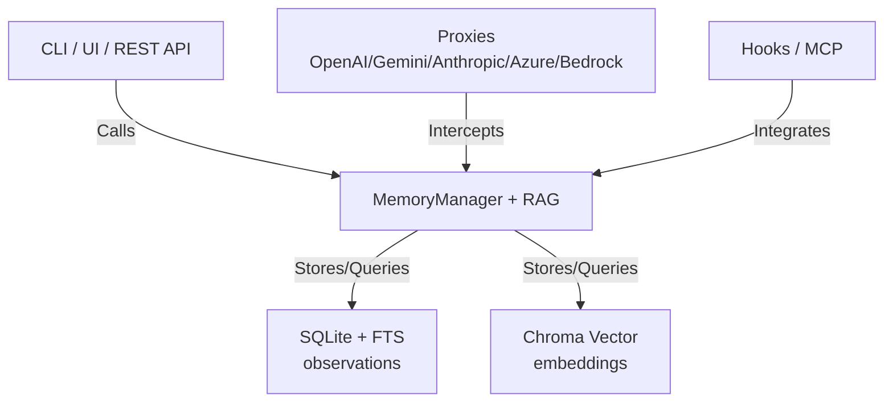

# Architecture

## Core Concepts

- **Observation**: a single memory item. It has an id, session_id, project, type, content, summary, tags, metadata, and timestamps.
- **Project**: a folder path used to group observations.
- **Session**: a scoped work unit with a goal and timestamps. Sessions help you filter memory for a task.
- **Progressive disclosure**:
  - search: compact summaries
  - timeline: surrounding context
  - get: full details

Observation types are flexible, but common values include:
- note, decision, bugfix, feature, refactor, discovery, change, interaction, tool_output, file_content, summary

## System Architecture

ai-mem uses a layered retrieval pipeline:

1. **SQLite + FTS5** for keyword search and fast filtering.
2. **Chroma vector store** for semantic search over chunks.
3. **Progressive disclosure** to control context size.

Core components:

- **MemoryManager**: orchestrates storage, retrieval, and session tracking.
- **SQLite DB**: observations and sessions.
- **Vector store**: embeddings and semantic search.
- **Context builder**: formats `<ai-mem-context>` blocks with token estimates.
- **Web server**: REST API + viewer UI.
- **Proxies**: OpenAI-compatible, Gemini, Anthropic, Azure OpenAI, and Bedrock proxies.
- **MCP server**: tools for external clients.
- **Hook scripts**: for any lifecycle-based client.

