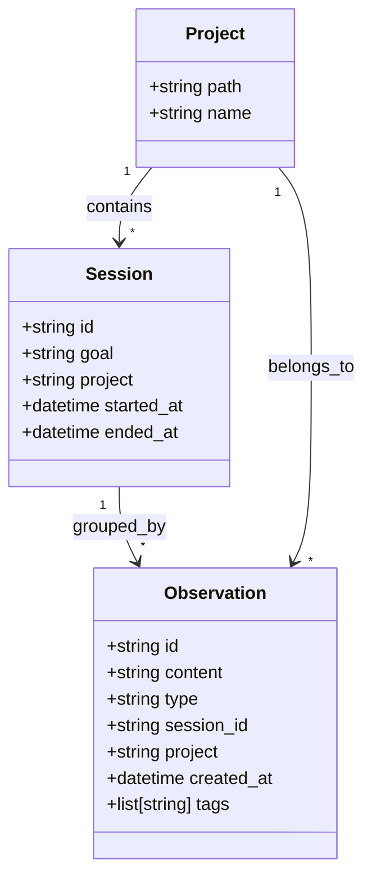
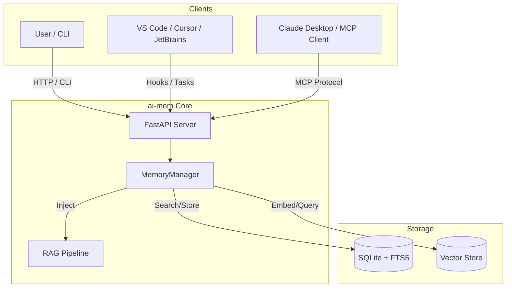
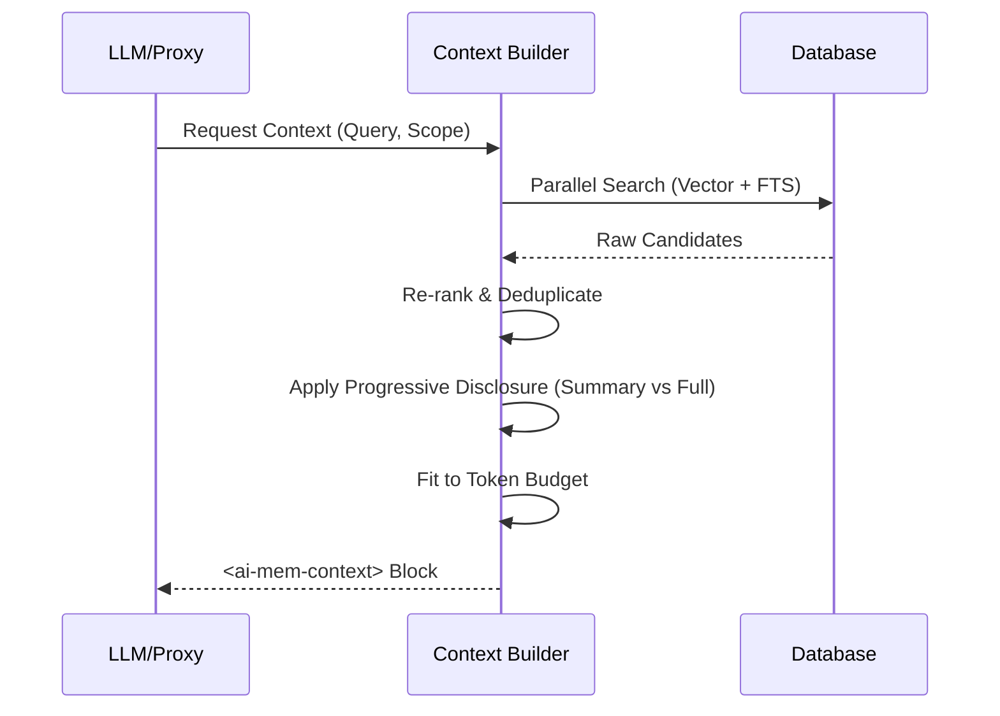

# Architecture

This document describes the internal design of **ai-mem**, a universal long-term memory layer for LLMs.

## Core Concepts

The system is built around a few key entities that structure how memory is stored and retrieved.

### Data Model

- **Observation**: The fundamental unit of memory. It captures a single event, note, or interaction.
  - **Types**: Flexible schemas like `note`, `decision`, `bugfix`, `feature`, `refactor`, `discovery`, `interaction`.
  - **Metadata**: Rich key-value pairs for filtering (e.g., `file_path`, `author`).
- **Project**: A logical container usually mapping to a filesystem path (e.g., `/home/user/projects/my-app`).
- **Session**: A scoped unit of work with a specific goal. Sessions allow you to filter memory retrieval to just the relevant context of a current task.
- **Progressive Disclosure**: A UI and retrieval pattern where information is revealed in stages:
  1.  **Search**: Keyword/Semantic match -> Compact summaries.
  2.  **Timeline**: Temporal context -> Surrounding observations.
  3.  **Get/Detail**: Full content -> Complete resolution.

## System Architecture

ai-mem operates as a central service that intercepts LLM calls or receives manual input, stores it, and reinjects relevant context.

### Retrieval Pipeline

The retrieval (RAG) pipeline creates a high-quality context block by combining retrieval methods:

1.  **Keyword Search (FTS5)**: Fast, exact-match filtering for specific terms (e.g., variable names, specific error codes).
2.  **Semantic Search (Vector)**: Embedding-based retrieval for finding conceptually related memories (e.g., "authentication issues" finding "login bug").
3.  **Recency Scoring**: Boosting newer memories to ensure relevance.
4.  **Deduplication**: Merging results from all methods.
5.  **Token Budgeting**: selecting the highest-ranked items that fit within the `context-window`.

### Context Injection Flow

### Scoreboard & token economics

Every retrieval call surfaces a `scoreboard` entry per observation (`fts_score`, `vector_score`, `recency_factor`) plus token totals (`tokens.index`, `tokens.full`, `tokens.total`) and optional `economics` data. This metadata flows through the CLI, MCP server, and REST endpoints so any assistant—Claude Desktop, Gemini, ChatGPT, or custom vLLM—can inspect the reasoning before replying.

The same scoreboard and token insights also power the web UI at `http://localhost:37777`, providing citations via `/api/observation/{id}` and cache hit/miss telemetry for debugging.

### Endless mode & checkpoints

`ai-mem endless` drives long-running sessions by looping over context generation, auto-adjusting the observation window to honor token budgets while printing scoreboard rows and cache health at each interval. Use `snapshot export/merge` to persist memory checkpoints or sync another device so that multiple LLMs share the same evolving history without losing IDs or metadata.

## Storage Layout

By default, data is stored in `~/.ai-mem`, making it easy to back up or sync.

- **`ai-mem.sqlite`**: Stores the relational data (Observations, Sessions) and the FTS5 full-text search index.
- **`vector-db/`**: Stores the ChromaDB (or other provider) artifacts for embeddings.
- **Config**: JSON-based configuration allows overriding paths to support multi-tenant or project-specific storage.
