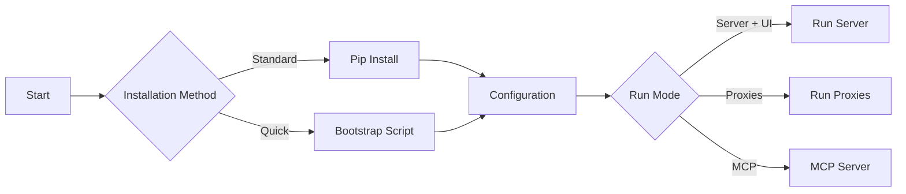

# Getting Started


Welcome to **ai-mem**! This guide will help you set up your personal AI memory layer in minutes.



## Installation

### Prerequisites

> [!NOTE]
> Ensure you have **Python 3.10+** installed. If you plan to use the `pgvector` provider, you will also need PostgreSQL 15+ with the extension enabled.

### Option A: Quick Bootstrap (Recommended)

The easiest way to get started is using the helper script which sets up the virtual environment and installs dependencies for you.

```bash
./scripts/bootstrap.sh
```

### Option B: Manual Installation

If you prefer to manage your environment manually:

```bash
# 1. Clone the repository
git clone https://github.com/yourusername/ai-mem.git
cd ai-mem

# 2. Create and activate virtual environment
python3 -m venv .venv
source .venv/bin/activate

# 3. Install in editable mode
pip install -e .
```

## Quick Start Details

Once installed, you can interact with ai-mem via the CLI immediately, no API keys required for basic storage.

### CLI Usage

> [!TIP]
> The CLI is great for quick interactions or scripting.

```bash
# Store a memory
ai-mem add "We use Python 3.11 and pandas 2.0 in Omega."

# Retrieve relevant memories
ai-mem search "Omega dependencies"
```

### Endless Mode & context streaming

`ai-mem endless` keeps regenerating context on a loop, prints scoreboard/cache telemetry every tick, and stays within your token budget so you can feed Claude, Gemini, ChatGPT, or any vLLM with fresh continuity.

```bash
ai-mem endless --query "next steps" --interval 30 --token-limit 900
```

Each iteration shows the same `fts_score`, `vector_score`, and `recency_factor` entries that `mem-search`, `timeline`, and the web UI expose, helping you understand why memories were selected before pasting or proxying them.

### Snapshot export & merge

Capture or share a workspace by exporting a checkpoint:

```bash
ai-mem snapshot export backups/gear.ndjson
```

Another device (or session) can then merge it back:

```bash
ai-mem snapshot merge backups/gear.ndjson
```

Merge operations preserve IDs and metadata so you can stitch together threaded conversations that span Claude, Gemini, or other assistants without losing referential links.

### Model-agnostic context injection

Use `ai-mem context` to build `<ai-mem-context>` blocks for any model. The command prints token budgets (`tokens.index`, `tokens.full`) plus chassis metadata (`scoreboard`, `cache`, `economics`) so every assistant can introspect the reason for a retrieval before replying.

### Starting the Web UI

To visualize your memory graph and manage sessions, start the web server:

```bash
./scripts/run.sh
```
Then open [http://localhost:8000](http://localhost:8000) in your browser.

## Convenience Scripts

We provide a suite of scripts in `scripts/` to launch common configurations.

| Script | description |
| :--- | :--- |
| **Server & UI** | |
| `./scripts/run.sh` | Core server + Web UI. |
| `./scripts/run-all.sh` | Server + UI + MCP Server. |
| **Proxies (Intercept Traffic)** | |
| `./scripts/run-stack.sh` | Server + OpenAI-compatible Proxy. |
| `./scripts/run-gemini-stack.sh` | Server + Gemini Proxy. |
| `./scripts/run-anthropic-stack.sh` | Server + Anthropic Proxy. |
| **Integrations** | |
| `./scripts/install-mcp-claude-desktop.sh` | Register with Claude Desktop. |
| `./scripts/install-mcp-cursor.sh` | Register with Cursor IDE. |
