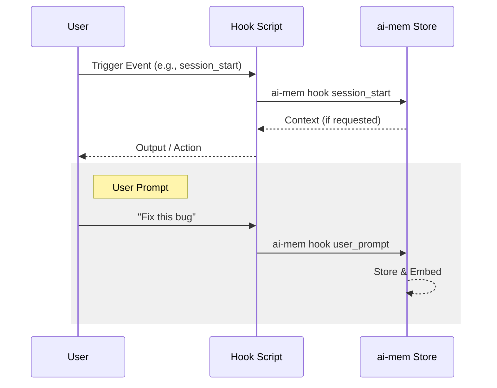

# Hooks

## Hooks (Model Agnostic)



Use scripts in `scripts/hooks` with any client that supports shell hooks.

Examples:

```bash
# Session start: print context
AI_MEM_PROJECT="$PWD" scripts/hooks/session_start.sh

# Store a user prompt
AI_MEM_PROJECT="$PWD" AI_MEM_CONTENT="Fix OAuth flow" scripts/hooks/user_prompt.sh
```

You can also use the CLI hook runner (no shell scripts required):

```bash
# Session start: print context
ai-mem hook session_start --project "$PWD"

# Store a user prompt from stdin
echo "Fix OAuth flow" | ai-mem hook user_prompt --project "$PWD" --content-file -
```

You can pass metadata and attachments to the hook runner as well, for example:

```bash
ai-mem hook user_prompt --metadata author=sergio --file docs/notes.md
```

Generate a hook config snippet for clients that accept command hooks:

```bash
ai-mem hook-config --bin "$PWD/.venv/bin/ai-mem" --project "$PWD"
```

Hook environment variables (common):
- `AI_MEM_BIN`: path to ai-mem binary
- `AI_MEM_PROJECT`: project path
- `AI_MEM_SESSION_ID`: scope context + storage to a specific session
- `AI_MEM_CONTENT`: content to store
- `AI_MEM_TAGS`: comma-separated tags
- `AI_MEM_OBS_TYPE`: override type
- `AI_MEM_NO_SUMMARY`: disable summarization
- `AI_MEM_SESSION_TRACKING`: session_start opens, session_end closes
- `AI_MEM_SUMMARY_ON_END`: run summarize after session_end
- `AI_MEM_SUMMARY_COUNT`: number of observations to summarize (default 20)
- `AI_MEM_SUMMARY_OBS_TYPE`: filter observation type for summaries
- `AI_MEM_METADATA`: JSON or `key=value` pairs to attach extra metadata
- `AI_MEM_ASSET_FILES`: comma-separated file paths whose contents are stored as file assets
- `AI_MEM_ASSET_DIFFS`: comma-separated patch/diff paths for diff assets

Hooks can auto-load a local env file before running:

- Default: `hooks.env` in the same directory as the hook script.
- Override with `AI_MEM_HOOKS_ENV=/path/to/hooks.env`.

Install the hooks into a shared location:

```bash
./scripts/install-hooks.sh
```

## IDE Integrations

Helper scripts are included for popular IDEs:

- VS Code tasks: `./scripts/install-vscode-tasks.sh`
- JetBrains External Tools: `./scripts/install-jetbrains-tools.sh`
- Neovim Lua Module: `./scripts/install-neovim.sh`
- Cursor MCP: `./scripts/install-mcp-cursor.sh`

These install project-local tasks or config entries so you can launch ai-mem servers, proxies, and hooks from inside the IDE.

## Neovim Integration

To install the Neovim integration:

```bash
./scripts/install-neovim.sh
```

This creates `~/.config/nvim/lua/ai-mem.lua`. Then in your `init.lua`, add:

```lua
require("ai-mem").setup({bin = "/path/to/ai-mem"}) -- Optional bin path override
```

Available commands:
- `:AIMemStart` - Start a session
- `:AIMemEnd` - End session and summarize
- `:AIMemNote` - Add a quick note
- `:AIMemContext` - View current context in a split
- `:AIMemSel` - (Visual mode) Add selection as an observation

## Context, scoreboard, and streaming

Use `ai-mem context` whenever you need a `<ai-mem-context>` block. The CLI prints token budgets (`tokens.index`, `tokens.full`, `tokens.total`), scoreboard metadata (`fts_score`, `vector_score`, `recency_factor`), and cache stats so Claude, Gemini, Antigravity, or any other LLM can inspect why memories were selected before replying.

```bash
ai-mem context --query "deploy checklist" --show-tokens
```

The same metadata flows through `ai-mem endless` (auto-refreshing context for long-lived workflows) and the MCP server, so every agent sees the same reasoning. Call `ai-mem endless` from a hook script when you want a persistent stream, then relay the printed context block into your model prompt.

## Endless mode & checkpoint syncing

`ai-mem endless` loops over the context builder, adjusts the observation window to honor a token cap, and prints cache/scoreboard telemetry on each tick. Use it from hooks if you want to keep an LLM session warm without restarting it.

```bash
ai-mem endless --query "design notes" --interval 20 --token-limit 1000
```

Snapshot commands (`ai-mem snapshot export` / `ai-mem snapshot merge`) let you capture a project’s state and rehydrate another workspace (or a new LLM) while preserving IDs/metadata. Run them from hooks when you want to persist session history for collaboration or offline review.
