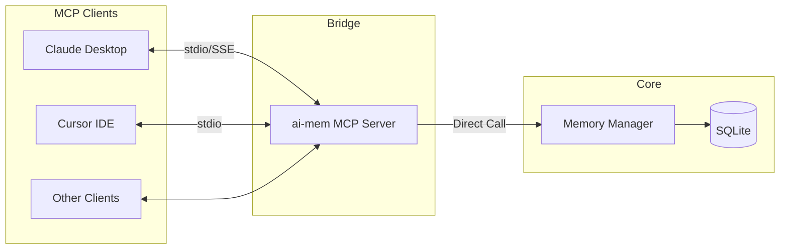

# MCP Tools and Integrations

**Model Context Protocol (MCP)** allows ai-mem to expose its memory tools directly to LLM interfaces like **Claude Desktop** and **Cursor**.



## Setup Guides

### 1. Claude Desktop

Run the helper script to automatically register ai-mem with your Claude Desktop config:

```bash
./scripts/install-mcp-claude-desktop.sh --bin "$PWD/.venv/bin/ai-mem"
```

### 2. Cursor IDE

Add ai-mem to Cursor's MCP settings:

```bash
./scripts/install-mcp-cursor.sh --bin "$PWD/.venv/bin/ai-mem"
```

## Available Tools

The MCP server exposes the following tools to the LLM:

| Tool Name | Description |
| :--- | :--- |
| **`search`** | Find memories by keyword/semantic meaning. |
| **`timeline`** | View chronological context around an event. |
| **`summarize`** | Generate and store a summary of recent sessions. |
| **`context`** | Retrieve a formatted context block for injection. |
| **`stats`** | View global knowledge graph statistics. |
| **`tag-*`** | Manage (add/rename/delete) tags. |

### Ranking Metadata

`mem-search` and `timeline` return rich metadata including a **Scoreboard**.

> [!TIP]
> This allows the LLM to understand *why* a memory was retrieved (e.g., "High Vector Score" vs "Exact Keyword Match").

Structure of the response:
- `results`: The list of memory items.
- `scoreboard`: Breakdown of FTS, Vector, and Recency scores.
- `cache`: Hit/Miss status to monitor performance.

### Scoreboard & cache telemetry

Every MCP response mirrors the same scoreboard metadata that powers the CLI and UI. Each observation is paired with `fts_score`, `vector_score`, and `recency_factor`, and the `cache` section records hits/misses so assistants can reason about retrieval quality before replying.

All scores show up in the web UI at [http://localhost:37777](http://localhost:37777) as well, alongside links to `/api/observation/{id}` for citations.

### Shared context for every model

`context` returns `<ai-mem-context>` blocks, so Claude Desktop, Gemini CLI, ChatGPT, and other vLLMs can all reuse the same generated text. Pair it with `ai-mem endless` for continuous refreshes or `ai-mem snapshot merge` when you want to import checkpoints from another device; the MCP server simply exposes the current memory state, so every model sees the same history with consistent metadata.

## Manual Configuration

If you need to generate a raw config for other MCP clients:

```bash
# Generate JSON snippet
ai-mem mcp-config --bin "$PWD/.venv/bin/ai-mem"
```

## Claude Code Plugin

For the command-line interface `claude-code`, use our local plugin:

```bash
./scripts/install-claude-plugin.sh
```

See `plugin/README.md` for advanced plugin details.
