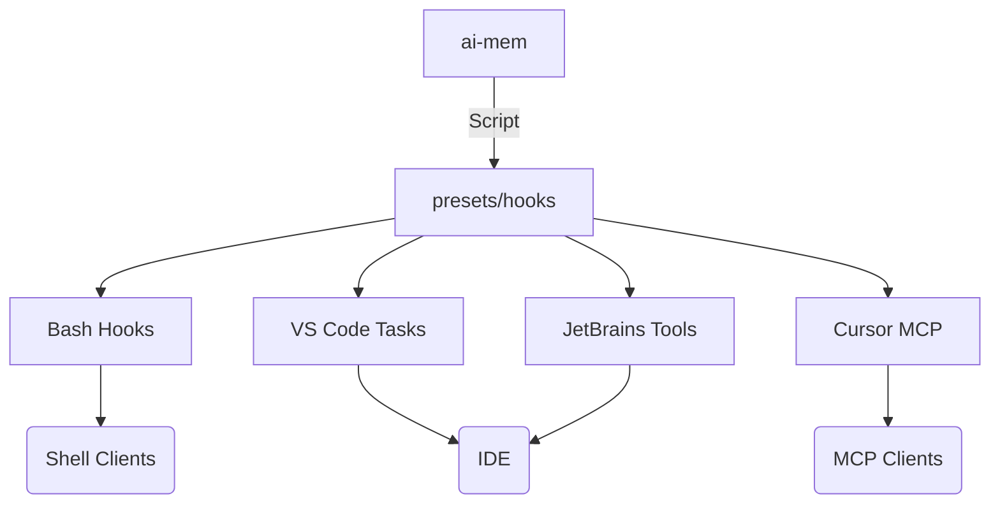

# Hook & Preset Catalog

This catalog highlights the installer scripts and helper configs that let you drop ai-mem into the same workflows Claude-Mem provides for Claude Desktop, Cursor, Antigravity, and popular IDEs.



## Claude Desktop & mem-search skill

1. Install the Claude Code plugin:
   ```bash
   ./scripts/install-claude-plugin.sh
   ```
2. Set `AI_MEM_BIN` so Claude can reach the venv binary:
   ```bash
   export AI_MEM_BIN="$PWD/.venv/bin/ai-mem"
   ```
3. The plugin hooks into `SessionStart`, `UserPromptSubmit`, `PostToolUse`, and `Stop`, stores a `claude-code` tag, and mirrors the mem-search workflow that Claude-Mem ships with. See `plugin/README.md` for the full list of env overrides.

## Hooks & CLI presets

- Run `./scripts/install-hooks.sh` to install the shell hook scripts (`scripts/hooks/*.sh`) into `~/.config/ai-mem/hooks` so any shell-based client can call `ai-mem hook <event>` with the right environment.
- Use `ai-mem hook-config` (or the scripts above) to generate a snippet for arbitrary clients that call hooks on events like `session_start`, `user_prompt`, `tool_output`, and `session_end`.
- The CLI hook runner (`ai-mem hook`) can be called from any environment — it accepts metadata, files, diffs, session tracking toggles, and context options so you can reproduce the same behavior as the shell scripts.

## IDE & editor helpers

- `./scripts/install-vscode-tasks.sh` installs `ai-mem` tasks for running the server, proxies, and hooks from within VS Code.
- `./scripts/install-jetbrains-tools.sh` adds External Tools entries to JetBrains IDEs.
- `./scripts/install-mcp-cursor.sh` adds ai-mem MCP tools to Cursor for instant queries from within the editor.
- Use `./scripts/install-mcp-claude-desktop.sh` to add ai-mem as an MCP tool inside Claude Desktop if you prefer the MCP workflow (instead of the local plugin above).

## Antigravity & other MCP clients

- Antigravity (and other MCP-capable apps) can call the ai-mem MCP server (`ai-mem mcp`). Run `AI_MEM_API_TOKEN=... ai-mem mcp` and configure Antigravity’s MCP integration to point at the same binary/endpoint. The `tools/list` response advertises `mem-search`, `timeline`, `context`, etc., with the same scoreboard metadata you see in the web viewer.
- If Antigravity supports incoming hook scripts, use `./scripts/install-hooks.sh` or `ai-mem hook-config` to drop the hook commands into its lifecycle events.

## Cross-model memory sharing example

1. Start the ai-mem server (with UI + MCP) so Claude, Gemini, and other clients can call it:

   ```bash
   ./scripts/run-all.sh
   ```

2. In parallel, keep an `ai-mem endless` session running (see [Endless Mode](endless_mode.md)) to refresh context for long-lived flows:

   ```bash
   ai-mem endless --query "next steps" --interval 20 --token-limit 950
   ```

   Each tick prints the `scoreboard` (FTS, vector, recency) and cache stats the MCP tools and UI expose. You can pipe that output directly into Claude Desktop or Gemini prompts, and every model sees the same eligibility reasoning.

3. Start the Gemini proxy/stack so it registers with the same MCP server and can call the shared context:

   ```bash
   ./scripts/run-gemini-stack.sh
   ```

4. Capture a checkpoint from one device (see [Snapshots](snapshots.md)), ship it to another, and merge it to keep both assistants aligned:

   ```bash
   ai-mem snapshot export ~/tmp/ai-mem-checkpoint.ndjson
   scp ~/tmp/ai-mem-checkpoint.ndjson remote:/tmp/
   # On the remote machine:
   ai-mem snapshot merge /tmp/ai-mem-checkpoint.ndjson
   ```

   The merged checkpoint retains IDs and metadata, so Claude Desktop and Gemini continue to reference the same observations, timelines, and citations.

## Summary

Every installer script above is idempotent and can be re-run in project roots. Refer to `docs/hooks.md` for detailed hook usage and to `docs/mcp-tools.md` for MCP workflow instructions.
