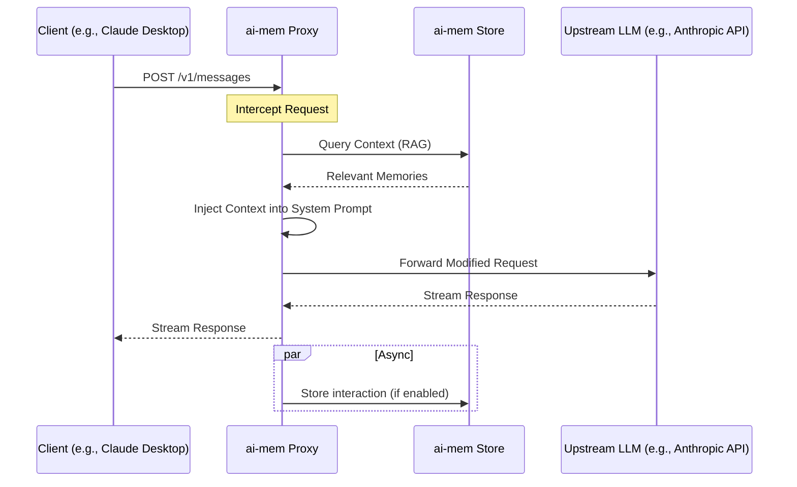

# Proxies

## Request Flow



## OpenAI-compatible proxy

```bash
AI_MEM_PROXY_UPSTREAM_BASE_URL="http://localhost:8000" ai-mem proxy --port 8081
```

Point your client to `http://localhost:8081/v1`

Supported endpoints:
- `/v1/chat/completions`
- `/v1/completions`
- `/v1/responses`

Headers:
- `x-ai-mem-project`: override project
- `x-ai-mem-session-id`: scope context + storage to a session
- `x-ai-mem-query`: override query for context
- `x-ai-mem-inject`: true/false
- `x-ai-mem-store`: true/false
- `x-ai-mem-obs-type`
- `x-ai-mem-obs-types`
- `x-ai-mem-tags`
- `x-ai-mem-total`
- `x-ai-mem-full`
- `x-ai-mem-full-field`
- `x-ai-mem-show-tokens`
- `x-ai-mem-wrap`

## Gemini proxy

```bash
AI_MEM_GEMINI_API_KEY="YOUR_KEY" ai-mem gemini-proxy --port 8090
```

Point your Gemini client to `http://localhost:8090`

Supported endpoints:
- `:generateContent`
- `:streamGenerateContent`

## Anthropic proxy

```bash
AI_MEM_ANTHROPIC_API_KEY="YOUR_KEY" ai-mem anthropic-proxy --port 8095
```

Point your Anthropic client to `http://localhost:8095`

Supported endpoints:
- `/v1/messages`

Env vars:
- `AI_MEM_ANTHROPIC_API_KEY` or `ANTHROPIC_API_KEY`
- `AI_MEM_ANTHROPIC_UPSTREAM_BASE_URL`
- `AI_MEM_ANTHROPIC_VERSION` (default 2023-06-01)

## Azure OpenAI proxy

```bash
AI_MEM_AZURE_API_KEY="YOUR_KEY" AI_MEM_AZURE_DEPLOYMENT="YOUR_DEPLOYMENT" AI_MEM_AZURE_UPSTREAM_BASE_URL="https://YOUR_RESOURCE.openai.azure.com" ai-mem azure-proxy --port 8092
```

Point your Azure OpenAI client to `http://localhost:8092/v1`

Supported endpoints:
- `/v1/chat/completions`
- `/v1/completions`
- `/v1/embeddings`

Env vars:
- `AI_MEM_AZURE_API_KEY` or `AZURE_OPENAI_API_KEY`
- `AI_MEM_AZURE_UPSTREAM_BASE_URL` or `AZURE_OPENAI_ENDPOINT`
- `AI_MEM_AZURE_DEPLOYMENT` or `AZURE_OPENAI_DEPLOYMENT`
- `AI_MEM_AZURE_API_VERSION` or `AZURE_OPENAI_API_VERSION` (default 2024-02-01)

## Bedrock proxy

```bash
AI_MEM_BEDROCK_MODEL="anthropic.claude-3-haiku-20240307-v1:0" ai-mem bedrock-proxy --port 8094
```

Point your client to `http://localhost:8094/v1`

Supported endpoints:
- `/v1/chat/completions`
- `/v1/completions`

Notes:
- Streaming is only supported for Anthropic Bedrock models.
- You can override the model per request with `x-ai-mem-bedrock-model` or the `model` field in the payload.
- Supports the same context headers as the OpenAI-compatible proxy (`x-ai-mem-*`).

Env vars:
- `AI_MEM_BEDROCK_MODEL` (required, unless you pass `--model`)
- `AI_MEM_BEDROCK_REGION` / `AWS_REGION` / `AWS_DEFAULT_REGION`
- `AI_MEM_BEDROCK_PROFILE` / `AWS_PROFILE`
- `AI_MEM_BEDROCK_ENDPOINT`
- `AI_MEM_BEDROCK_ANTHROPIC_VERSION` (default bedrock-2023-05-31)
- `AI_MEM_BEDROCK_MAX_TOKENS` (default 1024)

## AWS Bedrock Configuration

Set AWS credentials + region via standard AWS environment variables or profiles:

- `AWS_REGION` / `AWS_DEFAULT_REGION`
- `AWS_PROFILE`
- `AWS_ACCESS_KEY_ID` / `AWS_SECRET_ACCESS_KEY` / `AWS_SESSION_TOKEN`

Optional overrides:
- `AI_MEM_BEDROCK_REGION`
- `AI_MEM_BEDROCK_PROFILE`
- `AI_MEM_BEDROCK_ENDPOINT` (custom endpoint)
- `AI_MEM_BEDROCK_MAX_TOKENS` (default 1024)
- `AI_MEM_BEDROCK_ANTHROPIC_VERSION` (default bedrock-2023-05-31)
- `AI_MEM_BEDROCK_EMBED_INPUT_TYPE` (for Cohere embed, default search_document)
