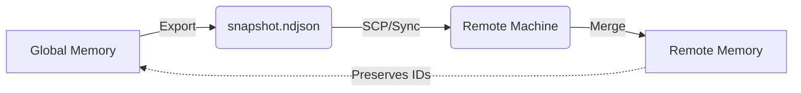

# Snapshots & Syncing

Snapshots allow you to capture the entire state of your **ai-mem** memory store—observations, embeddings, and metadata—into a portable file. This enables backup, migration, and team synchronization workflows.

## Overview

Unlike a simple database dump, `ai-mem` snapshots designed to be:
- **Portable**: JSON/NDJSON based formats that are easy to move.
- **Mergeable**: You can import a snapshot into an existing database without destroying current data. IDs are preserved to maintain provenance.
- **Incremental**: (Future capability) Strategies to avoid re-importing duplicates.

## Commands

### Exporting Memory

To save your current memory state to a file:

```bash
ai-mem snapshot export <file_path>
```

**Example:**
```bash
ai-mem snapshot export ./memory-backup-2024.ndjson
```

This file contains all your stored observations and their associated metadata.

### Merging Memory

To import memories from a snapshot file into your local store:

```bash
ai-mem snapshot merge <file_path>
```

**Example:**
```bash
ai-mem snapshot merge ./teammate-memory.ndjson
```

This command reads the observations from the file and inserts them into your local SQLite and Vector stores.

## Use Cases

### 1. Cross-Machine Handoff



Work on your laptop during the day, then sync context to your desktop at night.
Work on your laptop during the day, then sync context to your desktop at night.
1. **Laptop**: `ai-mem snapshot export handoff.ndjson`
2. **Transfer**: `scp handoff.ndjson desktop:~/`
3. **Desktop**: `ai-mem snapshot merge ~/handoff.ndjson`

### 2. Team Knowledge Sharing
If one team member has spent hours researching a complex topic (e.g., "Legacy Auth System"), they can export that specific "memory" (or their whole DB) and share it.
*Note: Currently `export` dumps the full database. Feature requests for filtered exports are tracked.*

### 3. Backups
Regularly snapshot your memory to avoid losing long-term context if your local environment is reset.

```bash
# Crontab example
0 4 * * * ai-mem snapshot export ~/backups/mem-$(date +%F).ndjson
```

## Best Practices

- **Deduplication**: The `merge` command handles ID conflicts gracefully, but be aware that merging the same snapshot multiple times is safe (idempotent for existing IDs).
- **Security**: Snapshots contain raw text of your observations. Treat these files with the same sensitivity as your source code or keys if you have been pasting sensitive info.
